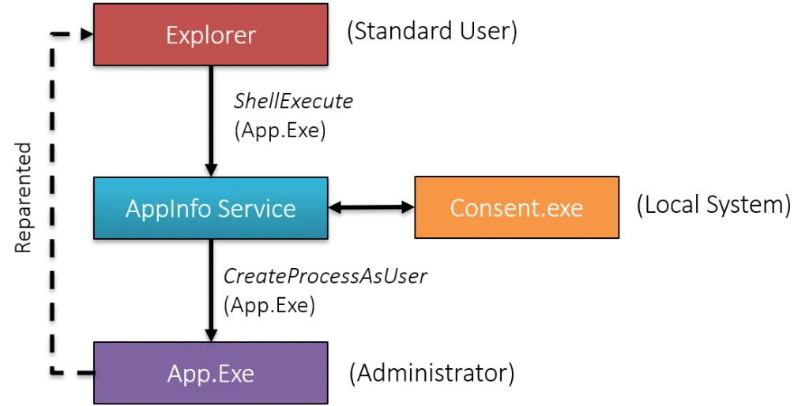
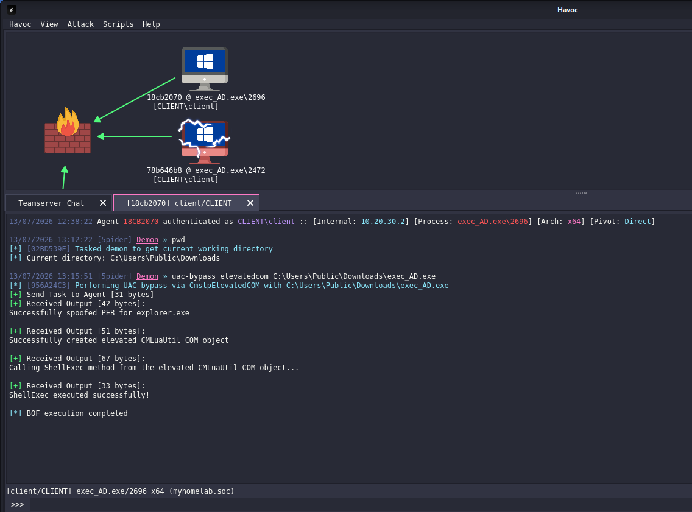
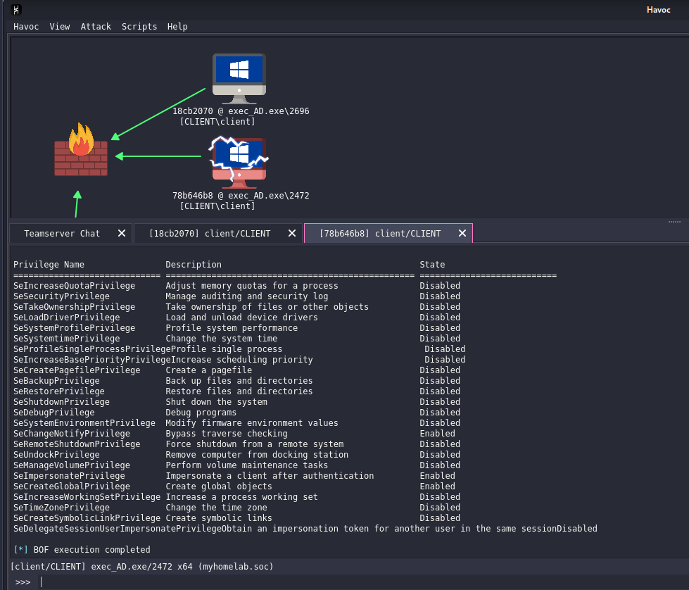

# Stage 3: Privilege Escalation UAC Bypass
## Lab Setup

> **Malware:** [Havoc C2](https://github.com/HavocFramework/Havoc) CmstpElevatedCOM extension 
> **MITRE Tactics:** [TA0004 Privilege Escalation](https://attack.mitre.org/tactics/TA0004/), [T1548.002 Abuse Elevation Control Mechanism: Bypass User Account Control](https://attack.mitre.org/techniques/T1548/002/) 
> **Technique Family:** CMSTPLUA / CMLuaUtil COM elevation abuse **COM Surrogate Process:** dllhost.exe 
> **Target Host/Victim/Agent:** 10.20.30.2 (Windows 10 Pro x64)
> **Starting Privilege Level:** Local Administrator with medium integrity level privilege 
> **Resulting Privilege Level:** Local Administrator with high integrity level privilege

## Understanding UAC 
The canonical example is when a process is launched elevated (for example, by right-clicking it in Explorer and selecting “Run as Administrator”. Here is a diagram showing the major components in an elevation procedure:



First, the user right-clicks in Explorer and asks to run some _App.Exe_ elevated. Explorer calls `ShellExecute`(`Ex`) with the verb “run as” that requests this elevation. 
Next, The _AppInfo_ service is contacted to perform the operation if possible. It launches _consent.exe_, which shows the Yes/No message box (for true administrators) or a username/password dialog to get an admin’s approval for the elevation. Assuming this is granted, the AppInfo service calls `CreateProcessAsUser` to launch the _App.exe_ elevated. To maintain the illusion that Explorer created _App.exe_, it stores the parent ID of Explorer into _App.exe_‘s new process management block. 
This makes it look as if Explorer had created App.exe, but is not really what happened. However, that “re-parenting” is probably a good idea in this case, giving the user the expected result.

Now here’s where things get interesting.

This entire elevation flow relies heavily on **trusted components** behaving as expected: Explorer, AppInfo, auto-elevated binaries, registry keys, and environment assumptions. UAC bypass techniques don’t usually “break” this flow they **abuse parts of it**. They will try to:
- Skip `consent.exe`
- Trick auto elevated binaries
- Abuse how parent child relationships are preserved
- Or convince Windows that elevation is already allowed
So instead of clicking _Run as Administrator_, the attacker finds a way to trigger a similar elevation path **without the prompt**. Same destination, fewer questions.

## Execution

With interactive C2 channel with Dev Tunnel from Stage 2, the next objective was to bypass UAC and gain High integrity level privilege in this host.

**1. Invoke the CmstpElevatedCOM module from the Havoc client:**

```
uac-bypass elevatedcom <Path_to_Execute_file>
```



**2. Module behavior:**

- Havoc invokes the `CmstpElevatedCOM` module
- Module loads the elevated CMLuaUtil COM object
- `dllhost.exe` becomes the COM surrogate under SYSTEM logon
- `dllhost.exe` calls `ShellExec` → spawns the Havoc agent executable elevated

**3. Confirm resulting privilege level**



### Detection Considerations

_(To be expanded in the detection-engineering document — noting here as a placeholder for cross-reference.)_

- Sysmon Event ID 1 (process creation): `dllhost.exe` spawning an unexpected child process (the Havoc agent executable), especially where the parent/child relationship or command line doesn't match normal COM surrogate usage.
- Sysmon Event ID 10 (process access) or Event ID 7 (image load) around `dllhost.exe` loading the CMLuaUtil COM object, if instrumented.
- Anomalous SYSTEM-level process spawning shortly after a non-elevated C2 session was active on the same host — correlate process lineage/timestamps in Wazuh.
