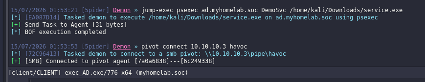

## Stage 5: Lateral Movement - SMB Named Pipe Pivoting

> **Malware:** [Havoc C2](https://github.com/HavocFramework/Havoc) 
> **MITRE Tactics:** [TA0008 Lateral Movement](https://attack.mitre.org/tactics/TA0008/) 
> **MITRE Techniques:** [T1021.002 Remote Services: SMB/Windows Admin Shares](https://attack.mitre.org/techniques/T1021/002/), [T1570 Lateral Tool Transfer](https://attack.mitre.org/techniques/T1570/) 
> **Attack Method:** PsExec over SMB + Havoc SMB listener (named pipe relay) 
> Source Host/Victim/Agent:** 10.20.30.2 (Windows 10 Pro x64)
> **Target Zone:** AD_Zone (10.10.10.0/24) 
> **Authentication:** Domain admin token/credentials (impersonated in Stage 4) 
> **Reference:** [ Home Grown Red Team: Lateral Movement With Havoc C2 And Microsoft EDR]([https://medium.com/@bherunda/hunting-detecting-smb-named-pipe-pivoting-lateral-movement-b4382bd1df4](https://assume-breach.medium.com/home-grown-red-team-lateral-movement-with-havoc-c2-and-microsoft-edr-300b7389b1f7))

**Precondition:**

- SYSTEM-level code execution (Stage 3)
- Domain admin token/credentials obtained via impersonation (Stage 4)
- Havoc C2 session active (Stage 2)

**Action:** Establish an SMB listener within Havoc on IIS_Server; use PsExec (authenticated with the domain admin token from Stage 4) to create a service on a target AD_Zone host; that service spawns a Havoc agent which connects back to the SMB listener via named pipe, pivoting the C2 channel onto the new host.

**Result:** Havoc C2 session established on a target host within AD_Zone, maintaining encrypted C2 communication via SMB named pipe relay instead of the devtunnel channel used on IIS_Server.

---
### Background: SMB Named Pipe Pivoting

Named pipes are a Windows IPC (inter-process communication) mechanism, typically used for local or network communication between processes. SMB (Server Message Block) can tunnel named pipe traffic over network shares, making it a viable lateral movement transport once an attacker has valid credentials or a token on a source machine.

![[Pivoting.png]]

The attack pattern works as follows:

1. **Source machine hosts an SMB listener** - Havoc creates a local named pipe endpoint that listens for incoming C2 agent connections.
2. **PsExec creates a service on the target** - using the domain admin credentials, PsExec establishes an authenticated SMB session to the remote host, creates a service, and the service spawns code.
3. **Target service connects back via the named pipe** - the spawned process on the target connects back to the source machine's named pipe via SMB, establishing a relay tunnel for C2 traffic.
4. **C2 communication flows over named pipe** - subsequent C2 commands and responses travel through the named pipe/SMB channel, encrypted by Havoc's native protocol, avoiding direct network-to-attacker exposure.

This is advantageous because:

- **SMB is legitimate Windows traffic** - network sensors may not scrutinize intra-network SMB as heavily as external C2 channels.
- **No external C2 server required** - the source machine acts as both the compromised asset and the relay point, reducing attacker infrastructure footprint.
- **Encrypted by default** - Havoc's C2 protocol is encrypted regardless of transport, so SMB packet inspection alone won't reveal plaintext commands.

---
### Execution

**Step 1: Establish Havoc SMB listener on IIS_Server**

In Windows implementation, every pipe is placed in the root directory of the named pipe filesystem (NPFS), mounted under the special path `\\.\pipe\` (that is, a pipe named "havoc" would have a full path name of `\\.\pipe\havoc).

From the Havoc client (with an active session), create an SMB listener:


**Step 2: Prepare PsExec invocation with domain admin credentials**

Using the domain admin token/credentials obtained in Stage 4, construct a PsExec command targeting a host in AD_Zone. The target should be a known/enumerated system in the 10.10.10.0/24 subnet:

```
jump-exec psexec <Domain_Host> <Service_name> <Service_file_Path>
```



**Step 3: PsExec creates a service and spawns the Havoc agent**

PsExec establishes an SMB connection to the target host using the domain admin credentials, creates a temporary service (or directly executes a command), and spawns the Havoc agent payload on the remote system:

```powershell
sc.exe query <Service_name>
```


**Step 4: Havoc agent connects back via named pipe**

The spawned Havoc agent on the target AD host locates the SMB listener (via hostname/IP resolution), connects to the named pipe, and establishes the relay:


### Detection Considerations

_(To be expanded in the detection-engineering document — noting here as a placeholder for cross-reference.)_

**Network/SMB level:**

- **Sysmon Event ID 3 (Network Connection):** unusual outbound SMB (port 445) from IIS_Server to multiple AD_Zone hosts, especially if the IIS service account shouldn't be initiating SMB connections.
- **Sysmon Event ID 18 (Pipe Connect):** named pipe creation/connection events on both IIS_Server (listener side) and target AD hosts (client side). Watch for suspicious pipe names or unexpected processes connecting to pipes.
- **Windows Security Event 5145 (Detailed File Share):** SMB share access logs showing the system creating named pipe connections; correlate with unexpected service creation.

**Host level (target AD host):**

- **Sysmon Event ID 13 (Registry Set):** registry modifications typical of service creation (HKLM\SYSTEM\CurrentControlSet\Services).
- **Sysmon Event ID 1 (Process Creation):** unexpected process spawned during service execution, especially if the parent is `svchost.exe` or `services.exe` from a temporary/unexpected service.
- **Windows Security Event 7045 (Service Install):** creation of a new service with an unusual/random name or suspicious executable path.

**Correlation:**

- Time-series alignment: PsExec SMB connection → service creation event → named pipe connection on target host. This sequence is the signature of SMB named pipe pivoting.
- Behavioral: domain admin token usage spike (Stage 4 impersonation → Stage 5 lateral movement) correlated with SMB outbound connections from a web server (unusual).
### Implications for AD_Zone Compromise

Once a C2 session is established on any host in AD_Zone, the attacker gains:

- Direct access to domain-joined systems
- Potential lateral movement to additional hosts (DC, member servers, workstations)
- Credential harvesting from the new host's memory/registry
- Ability to enumerate AD structure, user accounts, group memberships
- Stepping stone for privilege escalation to domain admin (if not already achieved)

This stage represents the critical threshold: the breach has moved from the isolated DMZ into the trusted internal network.

---