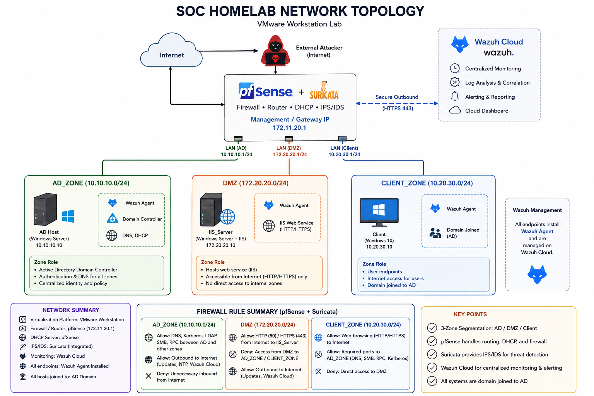

# Architecture Overview

## Purpose

This document provides a high-level summary of the SOC homelab environment: its zones, trust boundaries, monitoring layer, and intended attack surface. It is a companion to the **Architecture Document**, which contains full IP addressing, VLAN configuration, firewall rulesets, and pfSense-specific configuration. This overview is meant to orient a reader technical or not on _what the lab is_ and _why it's shaped this way_, before diving into implementation detail.

## Design Intent

The lab is built to emulate a small enterprise network with a realistic, exploitable trust boundary between an internet-facing service and an internal Active Directory environment. Rather than isolating each component for convenience, the topology intentionally reproduces a common real-world misconfiguration: **a domain-joined server sitting in the DMZ**. This creates a plausible path from external compromise to internal lateral movement, which is the core scenario the lab is designed to detect — not just prevent.

## Virtualization Platform

The entire environment runs on **VMware Workstation**, using **LAN Segments** to emulate isolated VLANs without requiring physical network hardware. Routing, DHCP, and firewalling between segments are centralized on a single **pfSense** virtual appliance, which acts as the sole boundary and control point between all zones.

## Network Zones

|Zone|Subnet|Role|
|---|---|---|
|**AD_Zone**|`10.10.10.0/24`|Internal Active Directory environment — domain controller and trusted internal assets|
|**DMZ**|`172.20.20.0/24`|Externally-facing services — hosts the IIS web server, the intended initial-access surface|
|**Client**|`10.20.30.0/24`|End-user workstation segment, bound to pfSense's LAN interface|

pfSense (`172.11.20.1`) provides DHCP, gateway, and firewall rules for all three zones, making it the single enforcement point for inter-zone traffic — and, from a detection standpoint, a natural place to anchor network-layer visibility.

## Identity and Trust

A single Active Directory domain spans all three zones:

- The **Domain Controller** resides in AD_Zone.
- The **IIS_Server** in the DMZ is domain-joined despite being internet/lab-facing — this is a deliberate design choice, not an oversight. It represents a common real-world weakness where perimeter services are joined to internal AD for management convenience, creating a direct trust relationship between an exposed asset and the internal domain.
- The **Client** workstation (Windows 10) is also domain-joined, representing a typical end-user endpoint.

This shared domain membership is what makes lateral movement from DMZ to AD_Zone architecturally possible, and it's the primary path the detection content in this lab is built around.

## Monitoring Layer

Every endpoint across all three zones runs a **Wazuh agent**, reporting to a centrally managed **Wazuh Cloud** instance. This gives uniform log and telemetry coverage regardless of which zone a host sits in, and centralizes detection engineering (rules, correlation, alerting) in one place rather than per-segment tooling.

## Threat Positioning

The simulated attacker operates **externally**, outside all three defined zones — representing a real-world internet-based threat actor. The IIS_Server in the DMZ hosts **Likeshop**, a PHP/ThinkPHP e-commerce application, which contains a known **SSRF vulnerability (CVE-2024-24028)**. This SSRF is being used as the intended initial-access vector; work is in progress to chain it into remote code execution (the exact SSRF-to-RCE mechanism, e.g. reaching an internally-exposed service, or a ThinkPHP-specific gadget chain is still under active testing and not yet finalized). Once a foothold is established, command-and-control is handled by the **Havoc C2 framework**, tunneled through **Microsoft dev tunnels (devtunnel)** into the DMZ. This C2 channel rides over legitimate Microsoft infrastructure and valid TLS, deliberately avoiding easy signature- or reputation-based detection, and is intended to be defeated (or caught) through behavioral and host-based detection rather than network blocklisting.

The intended kill chain the lab is built to exercise:

1. **Initial access** — external attacker exploits the Likeshop SSRF (CVE-2024-24028) on IIS_Server, chained toward RCE, to gain a foothold in the DMZ.
2. **Command and control** — foothold is upgraded to a full Havoc C2 implant, communicating out via devtunnel.
3. **Lateral movement** — pivot from the domain-joined IIS_Server into AD_Zone, abusing the DMZ-to-AD trust relationship.
4. **Privilege escalation / persistence** — establish elevated, durable access within the AD environment.

Full attacker infrastructure detail, the SSRF-to-RCE exploitation chain, TTP mapping, and detection logic for each stage are covered separately in the attack-simulation and detection-engineering documents.

## Summary

|Component|Detail|
|---|---|
|Platform|VMware Workstation, LAN Segments|
|Boundary/Control|pfSense (single point for routing, DHCP, firewall)|
|Zones|AD_Zone, DMZ, Client|
|Identity|Single AD domain spanning all zones (including DMZ — intentional)|
|Monitoring|Wazuh agents on all endpoints, centralized on Wazuh Cloud|
|Attacker position|External, via Likeshop SSRF (CVE-2024-24028) on IIS_Server → Havoc C2 over devtunnel|
|Core scenario|SSRF-based foothold in DMZ → C2 → lateral movement to AD → privilege escalation/persistence|

_See the dedicated Architecture Document for IP addressing tables, VLAN/interface configuration, and pfSense firewall rule sets._